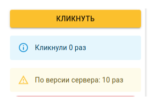

# Реализовать приложение, считающее количество кликов

Нужно написать приложение на React.js & TypeScript.

-   Приложение имеет кнопку Кликнуть и умеет отправлять количество кликов на сервер.
-   Пользователь n-раз нажимает на кнопку, количество нажатий суммирается 1 секунду, затем отправляется запрос. Если в течении 1 секунды на кнопку опять нажали, таймер перезапускается.
-   Механизм отправки запроса реализовать через custom hook (без использования Redux и подобных).
-   Во время ожидания ответа от сервера кнопку необходимо заблокировать и показать загрузку.
-   Ответ от сервера изобразить отдельным компонентом.
-   Учесть, что от сервера может прийти ошибка.
-   использование библиотеки mui приветствуется.

Решение принимается в виде репозитория на GitHub & GitHub Pages ([for npm use this package](https://www.npmjs.com/package/gh-pages))

Для удобства мы реализовали api: lk.zont-online.ru/api/button_count. Передать количество нажатий нужно в json: {count: 100}, ответ тоже будет содержать {count: 100}. В каждом запросе должен быть указан заголовок X-ZONT-Client. Укажите в этом заголовке ваш e-mail или иной контакт, по которому мы сможем связаться с вами в случае планируемых изменений в API.

Ссылка на наш API: https://zont-online.ru/api/docs/#3394112aa9
